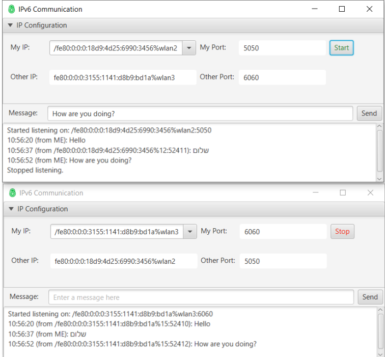

# Ipv6Chat
Ipv6Chat Java

## Chat T**ool**
We’ll implement a simple chat tool using multithreading and IPv6 addresses in Java. The tool has the
following features:
1. It can automatically fill in the IPv6 addresses owned by the computer. This is done using the DNS
   functionality in Java. The user selects the address to listen on using the Combobox on top.
2. It listens for incoming messages using a thread that the GUI can start and stop listening at will.
   Messages that arrive are sent as single lines, so there are no lingering connections left open.
3. Messages sent are sent to the recipient using the GUI thread in a single action so as not to make the
   GUI hang.
4. The log at the bottom of the screen shows all messages sent and received including a time stamp.
5. The tool checks that the provided ports and IP addresses are valid. If they’re not, the tool shows the
   problematic fields in red.
